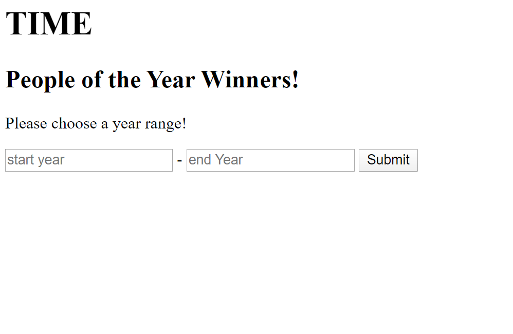

# My First MVC Application

## About Me Quiz

Lab09-First MVC App

*Author: Allyson Reyes*

----

## Description
This is a web application that displays all the people within the year in the range that the user inputs.

---

### Getting Started
Clone this repository to your local machine.


Deployed Site: [My First MVC App](https://firstmvcapp-lab09.azurewebsites.net/)

```
$ git clone [https://github.com/areyes986/Lab09-MVC-Core.git]
```

### To run the program from Visual Studio:
Select ```File``` -> ```Open``` -> ```Project/Solution```

Next navigate to the location you cloned the Repository.

Double click on the ```Lab00-MVC-Core``` directory.

Then select and open ```MyFirstMVCApp.sln```

---

### Visuals

#### Application Start

Here is the first page that displays to the user.


---

### Change Log 
1.4: *pending..*  
1.3: *readme* - 3.31.2020  
1.2: *created the necessary classes/folders* - 3.31.2020  
1.1: *Created initial set up for app* - 3.31.2020 


------------------------------
